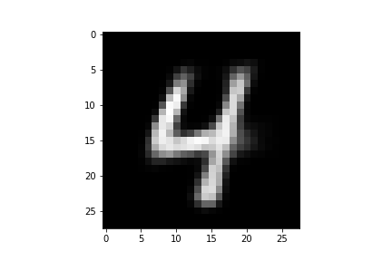
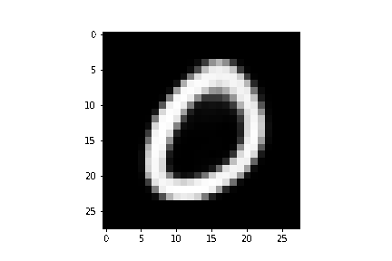
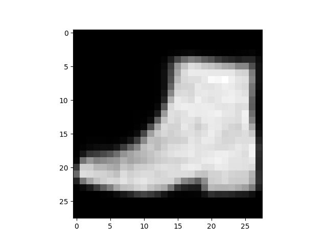

# Variational Autoencoders (VAE)

## Requisites
* Linux/ OSX system with FFmpeg and imagemagick
* Python 3
* Pytorch, Matplotlib, Numpy

Run ```sudo sh setup.sh``` to install and setup the required packages and softwares.

## Results
| Number of epochs | Dataset | Test Loss | Synthetic Images |
|    :-------:     |  :---:  |   :---:   | ------ |
| 10 | MNIST | 105.23 |  |
| 50 | MNIST | 100.09 |  |
| 20 | Fashion-MNIST | 238.51 |  |

### Where To Go Next
* Try with CelebA datasets
* Combine with DCGAN (VAE-GAN by [Rosca et al.](https://arxiv.org/pdf/1706.04987.pdf))

## References
* Auto-Encoding Variational Bayes by [Kingma et al.](https://arxiv.org/pdf/1312.6114.pdf)
* Stochastic Backpropagation and Approximate Inferencein Deep Generative Models by [Rezende et al.](https://arxiv.org/pdf/1401.4082.pdf)
* Junction Tree Variational Autoencoder for Molecular Graph Generation by [Jin et al.](https://arxiv.org/pdf/1802.04364.pdf)
* Understand Kullback-Leibler Divergence at [here](https://www.countbayesie.com/blog/2017/5/9/kullback-leibler-divergence-explained).
* https://github.com/altosaar/variational-autoencoder
* https://jaan.io/what-is-variational-autoencoder-vae-tutorial/